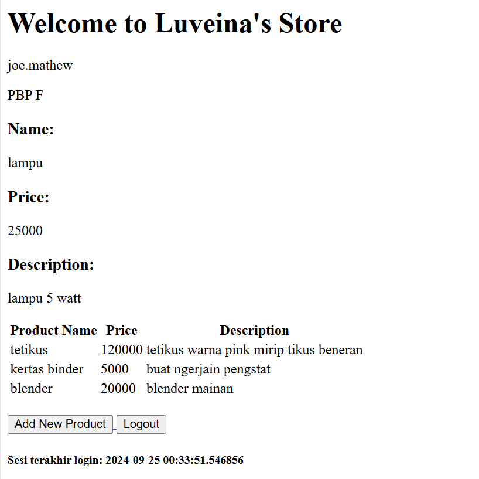

# Tugas Individu 2
Nama:   Luvenia Feodora Saragih  
NPM:    2306228402  
Kelas:  PBP F

Link Menuju Project: http://luvenia-feodora-luveinasstore.pbp.cs.ui.ac.id/

### Jelaskan bagaimana cara kamu mengimplementasikan checklist di atas secara step-by-step (bukan hanya sekadar mengikuti tutorial).
1. Untuk membuat project Django baru, hal pertama yang saya lakukan adalah membuat repositori baru di github dan kemudian melakukan clone repositori ke direktori lokal yang akan digunakan untuk membuat project. Setelah itu, saya menambahkan file `.gitignore` yang diisi dengan berkas-berkas yang tidak perlu didetect oleh Git. Kemudian, saya membuat virtual environment dan mengaktifkannya untuk mengunduh module-module yang diperlukan dalam pengembangan web berbasis Django. Setelah melakukan seluruh hal tersebut, baru saya dapat membuat project Django yang bernama "luveinas_store" dengan cara menjalankan kode berikut:  
``` django-admin startproject luveinas_store . ```

2. Untuk membuat aplikasi bernama "main", saya perlu untuk menjalankan kode:  
``` python manage.py startapp main ```  
Setelah itu, saya harus memasukkan "main" ke dalam daftar aplikasi yang terdapat pada `settings.py`

3. Agar aplikasi main pada proyek dapat dijalankan, saya harus membuat file `urls.py` terlebih dahulu pada direktori "main" yang berisi rute menuju fungsi yang akan menampilkan aplikasi main. Kemudian, saya juga menambahkan "main.urls" pada variabel urlpatterns di `urls.py` yang berada di direktori project untuk memastikan bahwa aplikasi main juga dapat diakses dengan menggunakan url menuju project.

4. Untuk membuat model pada aplikasi main dengan nama Product dan memiliki atribut name, price, dan description, saya harus mengganti file `models.py` yang terdapat pada direktori main, yaitu dengan mengganti nama class dengan "Product" dan mengisi class dengan atribut-atribut yang disesuaikan dengan tipe data yang mewakili atribut tersebut.

5. Agar dapat dilihat oleh orang lain, saya melakukan deployment melalui PWS dengan cara menekan tombol add new project, mengisi field project name dengan nama project yang akan saya buat dan kemudian menekan tombol create new project. Setelah itu, saya memasukkan URL deployment PWS saya ke variabel ALLOWED_HOSTS yang terdapat pada ```settings.py``` di direktori project Django saya. Setelah semua perubahan saya lakukan, termasuk membuat README ini, saya melakukan git add, commit, dan push ke GitHub dan PWS sehingga project ini dapat dilihat oleh orang lain.

### Buatlah bagan yang berisi request client ke web aplikasi berbasis Django beserta responnya dan jelaskan pada bagan tersebut kaitan antara `urls.py`, `views.py`, `models.py`, dan berkas html.  


### Jelaskan fungsi git dalam pengembangan perangkat lunak!  
Git berfungsi dalam memberikan fasilitas kepada para pengembang perangkat lunak untuk dapat berkolaborasi dalam prosesnya. Git mampu melacak perubahan yang dibuat pada source code (version control), membuat jalur pengembangan terpisah dari cabang utama (branching) dan menggabungkan kembali ke cabang utama (merge). 

### Menurut Anda, dari semua framework yang ada, mengapa framework Django dijadikan permulaan pembelajaran pengembangan perangkat lunak?
Menurut saya, framework Django dijadikan permulaan dalam pembelajaran pengembangan perangkat lunak karena terdapat banyak fitur bawaan yang siap untuk digunakan sehingga cocok untuk para pemula yang lebih diprioritaskan untuk mempelajari konsep terlebih dahulu. Selain itu juga, karena framework ini menggunakan bahasa pemrograman python, pemula juga akan dimudahkan dalam prosesnya karena python memiliki sintaks yang mudah dipahami.  

### Mengapa model pada Django disebut sebagai ORM?
Model pada Django disebut sebagai ORM karena mengkonversi datanya dalam basis data berbentuk tabel relasional. Hal ini membuat pengembang dapat berinteraksi dengan basis data tanpa perlu menulis SQL secara langsung.

# Tugas Individu 3
### Jelaskan mengapa kita memerlukan data delivery dalam pengimplementasian sebuah platform?
Kita memerlukan data delivery dalam pengimplementasian sebuah platform untuk memastikan bahwa data yang diperlukan oleh pengguna dapat diperoleh dengan cepat dan efisien.

### Menurutmu, mana yang lebih baik antara XML dan JSON? Mengapa JSON lebih populer dibandingkan XML?
Menurut saya, JSON lebih unggul karena strukturnya yang lebih sederhana dan mudah dimengerti oleh manusia dibandingkan dengan XML. Dalam XML, terdapat banyak tag yang harus dibuka dan ditutup, yang membuatnya lebih rumit dan panjang. Sebaliknya, struktur JSON menyerupai dictionary dalam Python, sehingga lebih mudah dibaca. Selain itu, JSON lebih populer karena lebih mudah diproses oleh bahasa pemrograman modern seperti JavaScript, di mana data dalam format JSON dapat langsung diolah tanpa memerlukan library tambahan atau alat bantu khusus. Ukuran file JSON yang umumnya lebih kecil dibandingkan dengan XML juga membuatnya lebih efisien dalam pengiriman data melalui jaringan, sehingga mempercepat proses transmisi.

### Jelaskan fungsi dari method is_valid() pada form Django dan mengapa kita membutuhkan method tersebut?
Method `is_valid()` pada form Django berfungsi untuk memastikan bahwa isi/data dari pengisian form merupakan informasi yang valid yang sesuai dengan retriksi yang diberikan. Kita membutuhkan method `is_valid()` agar dapat memperoleh data yang bersih dan sesuai dengan format yang kita inginkan.

### Mengapa kita membutuhkan csrf_token saat membuat form di Django? Apa yang dapat terjadi jika kita tidak menambahkan csrf_token pada form Django? Bagaimana hal tersebut dapat dimanfaatkan oleh penyerang?
Kita membutuhkan `crsf_token` saat membuat form di Django untuk melindungi aplikasi dari serangan Cross-Site Request Forgery (CSRF). Cross-Site Request Forgery (CSRF) adalah serangan yang bertujuan untuk membuat seorang pengguna melakukan hal-hal yang tidak diinginkan terhadap aplikasi berbasis web tanpa sepengetahuan pengguna tersebut. Keberadaan `csrf_token` adalah untuk memastikan semua token yang dikirimkan pada permintaan POST yang diterima oleh server sesuai dengan token yang dihasilkan oleh sesi dari pengguna tersebut untuk dapat melakukan POST. Ketidakadaan `csrf_token` dapat dimanfaatkan oleh penyerang untuk mengirimkan permintaan POST dengan menggunakan sesi pengguna yang aktif tanpa diketahui oleh server bahwa permintaan tersebut bukanlah permintaan yang sah dari pengguna.

### Jelaskan bagaimana cara kamu mengimplementasikan checklist di atas secara step-by-step (bukan hanya sekadar mengikuti tutorial).
1. Hal pertama yang saya lakukan adalah membuat `base.html` di dalam direktori templates pada direktori utama sebagai template umum untuk halaman web lainnya pada proyek. Kemudian, saya juga menambahkan base.html sebagai templates pada `settings.py` dan mengubah `main.html` saya ke dalam struktur yang telah didefinisikan pada `base.html`

2. Kemudian, saya menambahkan variabel id yang berisi UUID (string acak) pada class Product pada berkas `models.py` di direktori main agar setiap respons memiliki id yang unik.

3. Ketiga, saya membuat form input data produk dengan cara membuat berkas `forms.py` di direktori main yang bertujuan untuk menerima data produk baru yang akan dijual oleh Luveina's Store. pada file `forms.py` ini, saya membuat class ProductForm yang berisi fields nama produk, harga produk dan deskripsi produk.

4. Untuk memastikan bahwa form yang telah saya buat dapat ditampilkan ke pengguna, saya memodifikasi `views.py` milik direktori main dengan menambahkan fungsi baru yaitu `create_product(request)` yang menerima parameter request dengan tujuan untuk menampilkan form kepada pengguna dan menangkap respons pengguna melalui proses validasi hingga penyimpanan data. Selain itu, saya juga membuat file `create_product.html` sebagai file yang akan ditampilkan kepada pengguna.

5. Selain fungsi create_product, saya juga menambahkan 4 fungsi lainnya yaitu `show_xml(request)` dan `show_json(request)` untuk menampilkan data respons dalam bentuk xml dan JSON serta `show_xml_by_id(request, id)` dan `show_json_by_id(request, id)` untuk menampilkan data respons sesuai dengan id yang diberikan dalam bentuk xml dan JSON.

6. Untuk memastikan `urls.py` dapat mengarahkan pengguna ke laman yang tepat, saya mengimpor semua fungsi baru yang telah saya buat tadi dan menambahkan path URLnya ke dalam variabel urlpatterns milik `urls.py` pada direktori main

### Screenshot Postman


# Tugas Individu 4
### Apa perbedaan antara HttpResponseRedirect() dan redirect()
Secara fungsional, keduanya memiliki fungsi yang sama. Namun, `redirect()` merupakan bentuk lebih singkat, aman, fleksibel dan praktis karena hal yang dioper dalam argumen dapat berupa macam-macam hal, seperti URL, view, dan bahkan model. Sedangkan, `HttpResponseRedirect()` harus disertai dengan URL sehingga kita harus menyediakannya secara eksplisit.

### Jelaskan cara kerja penghubungan model Product dengan User!
Penghubungan model antara Product dan User pada kasus ini dilakukan dengan menggunakan ForeignKey, yaitu membuat relasi antara dua model dalam basis data. Dalam konteks ini, ForeignKey digunakan untuk menunjukkan bahwa setiap entri pada model Product terkait dengan satu User dan satu User dapat terkait dengan lebih dari satu entri

### Apa perbedaan antara authentication dan authorization, apakah yang dilakukan saat pengguna login? Jelaskan bagaimana Django mengimplementasikan kedua konsep tersebut.
Perbedaan authentication dan authorization terletak pada fungsinya. Authentication berfungsi untuk membatasi user yang dapat mengakses suatu laman. Sedangkan, authorization berfungsi untuk membatasi user dalam melakukan sesuatu di dalam laman tersebut

### Bagaimana Django mengingat pengguna yang telah login? Jelaskan kegunaan lain dari cookies dan apakah semua cookies aman digunakan?
Django mengingat user yang telah login dengan menggunakan session, yaitu cara untuk menyimpan informasi user di server dan mengirimkan session ID ke browser user. Sedangkan, cookies digunakan untuk menyimpan session ID di browser user. Kegunaan lain dari cookies adalah untuk menyimpan preferensi user, seperti bahasa, tema, dan lain-lain. Meskipun memiliki banyak kegunaan, tidak semua cookies aman digunakan karena cookies dapat digunakan untuk melacak user dan mengumpulkan informasi pribadi user.

### Jelaskan bagaimana cara kamu mengimplementasikan checklist di atas secara step-by-step (bukan hanya sekadar mengikuti tutorial).
1. Mengimpor UserCreationForm agar pendaftaran user dapat lebih mudah tanpa harus membuat dari awal
2. Membuat fungsi `register()` pada `views.py` yang berfungsi untuk menampilkan form pendaftaran user
3. Membuat `register.html` sebagai template untuk form pendaftaran user
4. Mengimpor fungsi `register()` dan menambahkan path URLnya ke dalam variabel urlpatterns pada `urls.py`
5. Mengimpor AuthenticationForm agar login logout dapat lebih mudah dilakukan tanpa harus membuat dari awal dan mengimpor fungsi `authenticate()`, `login()`, dan `logout()` pada `views.py` yang merupakan fungsi bawaan dari Django agar user dapat login dan logout
6. Membuat fungsi `login_user()` dan `logout_user()` pada `views.py` yang memanfaatkan fungsi bawaan `login()` dan `logout()` milik Django dengan sedikit modifikasi yang berfungsi untuk menampilkan form login user dan melakukan redirect ke halaman utama setelah logout
7. Membuat `login.html` sebagai template untuk form login user dan membuat button untuk logout
8. Mengimpor dan Menambahkan path URL `login_user()` dan `logout_user()` ke dalam variabel urlpatterns pada `urls.py`
9. Mengimpor fungsi `login_required` agar user yang belum login tidak dapat mengakses halaman tertentu dan menambahkan decorator `login_required` pada fungsi yang ingin diakses oleh user yang sudah login
10. Mengimpor datetime, HttpResposeRedirect, dan reverse untuk menampilkan waktu terakhir login user. Kemudian, menambahkan field last_login pada context di view.py agar dapat menyimpan waktu terakhir login user dan menampilkannya ketika user berhasil login. Ketika melakukan logout, cookie last_login akan dihapus
11. Mengimpor User pada `models.py` dan menambahkan user pada model Product dengan menggunakan ForeignKey agar setiap entri pada model Product terkait dengan satu User dan satu User dapat terkait dengan lebih dari satu entri

### Bukti Pembuatan Akun



# Tugas Individu 5
### Jika terdapat beberapa CSS selector untuk suatu elemen HTML, jelaskan urutan prioritas pengambilan CSS selector tersebut!
Urutan prioritas pengambilan CSS selector adalah sebagai berikut:
1. Inline CSS: Inline CSS memiliki prioritas tertinggi karena didefinisikan langsung pada elemen HTML.
2. Internal CSS: Internal CSS memiliki prioritas kedua karena didefinisikan pada tag `<style>` di dalam tag `<head>`.
3. External CSS: External CSS memiliki prioritas terendah karena didefinisikan pada file eksternal CSS.

### Mengapa responsive design menjadi konsep yang penting dalam pengembangan aplikasi web? Berikan contoh aplikasi yang sudah dan belum menerapkan responsive design!
Responsive design menjadi konsep yang penting dalam pengembangan aplikasi web karena memungkinkan tampilan aplikasi web menyesuaikan diri dengan berbagai perangkat dan ukuran layar yang berbeda. Contoh aplikasi yang sudah menerapkan responsive design adalah Google, Facebook, dan Twitter. Sedangkan, contoh aplikasi berbasis web yang belum menerapkan responsive design adalah SIAKNG.

### Jelaskan perbedaan antara margin, border, dan padding, serta cara untuk mengimplementasikan ketiga hal tersebut!
Margin adalah jarak antara elemen dengan elemen lainnya di luar border, sedangkan border adalah garis yang mengelilingi elemen, dan padding adalah jarak antara elemen dengan border. Untuk mengimplementasikan margin, border, dan padding, kita dapat menggunakan properti CSS `margin`, `border`, dan `padding` dengan nilai yang sesuai.

### Jelaskan konsep flex box dan grid layout beserta kegunaannya!
Flexbox adalah teknik layouting CSS yang memungkinkan elemen-elemen dalam suatu container untuk menyesuaikan ukuran dan posisinya secara dinamis. Flexbox sangat berguna untuk membuat tata letak yang responsif dan fleksibel. Grid layout adalah teknik layouting CSS yang memungkinkan elemen-elemen dalam suatu container untuk diatur dalam grid dua dimensi. Grid layout sangat berguna untuk membuat tata letak yang kompleks dan simetris.

### Jelaskan bagaimana cara kamu mengimplementasikan checklist di atas secara step-by-step (bukan hanya sekadar mengikuti tutorial)!
1. Menambahkan tailwind ke aplikasi Django dengan cara meletakkan script CDN Tailwind di bagian head pada `base.html` yang berperan sebagai template utama aplikasi.
2. Menggunakan Tailwind CSS untuk mengatur tata letak dan tampilan aplikasi dengan cara menambahkan class-class yang disediakan oleh Tailwind CSS pada elemen-elemen HTML yang ingin diubah tampilannya, contohnya pada file `login.html`, `register.html`, `create_product.html`, `main.html`, `edit_product.html`, `card_product.html`, `card_info.html`, dan `navbar.html`.
3. Membuat fungsi `delete_product()` dan `edit_product()` pada `views.py` yang berfungsi untuk menghapus dan mengedit data produk.
4.  Membuat tombol edit dan delete pada setiap card product yang akan mengarahkan ke halaman edit dan delete produk yang telah dibuat sebelumnya.

# Tugas Individu 6
### Jelaskan manfaat dari penggunaan JavaScript dalam pengembangan aplikasi web!
1. Interaktif: JavaScript memungkinkan pengguna untuk menambahkan interaksi dan responsivitas pada aplikasi web. Misalnya, animasi, validasi form, dan navigasi halaman.
2. Kecepatan: JavaScript dieksekusi langsung oleh browser pengguna tanpa perlu berkomunikasi dengan server, sehingga dapat meningkatkan kecepatan aplikasi web.
3. Ekosistem Luas: JavaScript memiliki banyak library dan framework yang dapat digunakan untuk memperluas fungsionalitas aplikasi web.

### Jelaskan fungsi dari penggunaan `await` ketika kita menggunakan `fetch()`! Apa yang akan terjadi jika kita tidak menggunakan `await`?
Penggunaan `await` pada `fetch()` digunakan untuk menunggu hingga proses pengambilan data dari server selesai sebelum melanjutkan eksekusi kode selanjutnya. Jika kita tidak menggunakan `await`, maka kode selanjutnya akan dieksekusi sebelum proses pengambilan data dari server selesai, sehingga data yang diambil tidak akan tersedia.

### Mengapa kita perlu menggunakan decorator `csrf_exempt` pada view yang akan digunakan untuk AJAX POST?
Kita perlu menggunakan decorator `csrf_exempt` pada view yang akan digunakan untuk AJAX POST agar request POST yang dikirimkan melalui AJAX tidak memerlukan token CSRF. Hal ini diperlukan karena token CSRF tidak dapat diambil dari JavaScript, sehingga request POST yang dikirimkan melalui AJAX akan dianggap tidak valid jika tidak menggunakan `csrf_exempt`.

### Pada tutorial PBP minggu ini, pembersihan data input pengguna dilakukan di belakang (backend) juga. Mengapa hal tersebut tidak dilakukan di frontend saja?
Pembersihan data input pengguna dilakukan di belakang (backend) juga karena data yang dikirimkan oleh pengguna dapat dimanipulasi oleh pengguna jahat. Oleh karena itu, pembersihan data input pengguna harus dilakukan di backend untuk memastikan data yang diterima oleh server adalah data yang valid dan aman.

### Jelaskan bagaimana cara kamu mengimplementasikan checklist di atas secara step-by-step (bukan hanya sekadar mengikuti tutorial)!
1. Mengimport `csrf_exempt` dari `django.views.decorators.csrf` dan `require_POST` agar hanya menerima request POST dan agar request POST yang dikirimkan melalui AJAX tidak memerlukan token CSRF.
2. Membuat fungsi `add_product_ajax()` pada `views.py` yang berfungsi untuk menambahkan data produk baru melalui AJAX dan menambahkan routingnya juga ke dalam `urls.py`.
3. Membuat fungsi `refreshProducts()` pada `main.html` yang berfungsi untuk mengupdate secara berkala dan asynchronous data produk yang ditampilkan pada halaman utama.
4. Membuat modal sebagai form untuk menambahkan produk baru pada `main.html` dan menambahkan event listener pada tombol submit form untuk mengirimkan data produk baru melalui AJAX.
5. Menggunakan strip_tags pada fungsi `add_product_ajax()` pada `views.py` untuk membersihkan data input pengguna dari tag HTML yang berbahaya.